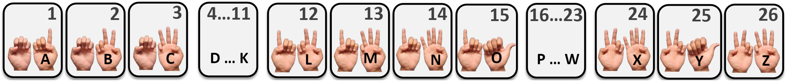
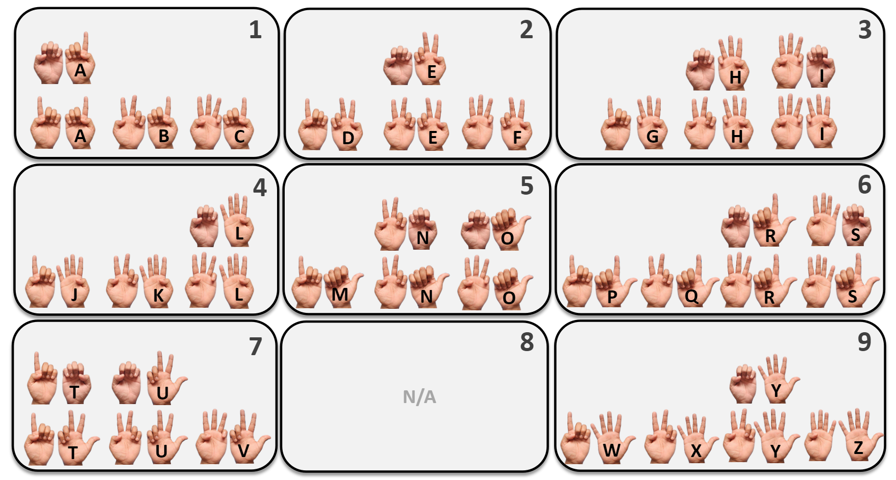
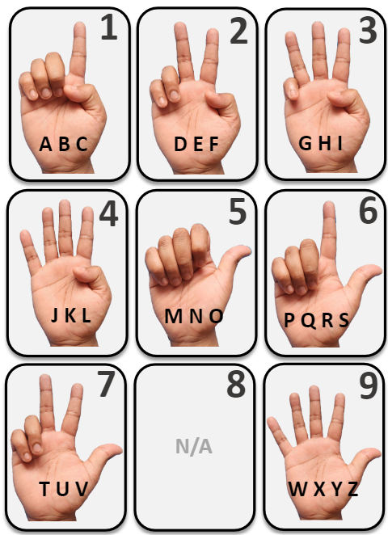

# Abacus Typing

Abacus Gestures are a set of 100 mid-air gestures based on the Finger Abacus or Chisanbop technique. This repository demonstrates the use of the abacus gestures for mid-air typing on a virtual keyboard. Three different keyboards layouts are implemented: a linear layout, a bimanual T9 layout (chorded), and a unimanual T9 layout (ambiguous).

### Linear Layout

The linear layout maps the 26 letters of the alphabet to the 26 abacus gestures sequentially, as shown in the layout below.



### Bimanual T9 Layout

This layout maps bimanual gestures to a T9 layout in two levels. The eight groups of the T9 layout are mapped to gestures 1 - 7 and 9 (8 is ommited). Under each group, the three or four letters are mapped to the gestures 10, 20, 30, and 40 respectively. Unimanual gestures are also assigned to 12 frequently used letters. Dominant hand gestures: 1 - A, 2 - E, 3 - I, 4 - L, 5 - O, 6 - R, 7 - U, 9 - Y. Non-dominant hand gestures: 10 - T, 20 - N, 30 - H, 40 - S. The layout is shown below.



### Unimanual T9 Layout

The unimanual T9 layout maps unimanual gestures to a T9 layout in a single level. The eight groups of the T9 layout are mapped to gestures 1 - 7 and 9 (8 is ommited). Typing is ambiguas, as the same gesture can be used for multiple letters. Four suggestions are displayed on the screen to disambiguate the input. The layout is shown below.



## Installation

1. Install python 3.10.0 (tested)

2. Clone/download the repository

3. Open a terminal and navigate to the repository folder

4. (Optional) Create a virtual environment

```bash
pip install virtualenv
virtualenv venv -p path/to/python3.10.0
```

activate the virtual environment

```bash
source venv/bin/activate (Linux)
venv\Scripts\activate (Windows)
```

5. Install the required packages

```bash
pip install -r requirements.txt
```

## Usage

1. Move to the desired layout folder. For example, to use the linear layout:

```bash
cd /linear_layout
```

2. Run the python file.\
To run the linear layout without any word-completion:

```bash
python abacus_text_linear.py
```

To run the linear layout with word-completion:

```bash
python abacus_text_linear_comp.py
```

Linear and Binamual T9 layouts have both with and without word-completion versions. Unimanual T9 layout only has a version with word-completion.

## Citation

If you use this code for your research, please cite the following paper:

```
@article{ehtesham2023abacus,
  title={Abacus Gestures: A Large Set of Math-Based Usable Finger-Counting Gestures for Mid-Air Interactions},
  author={Ehtesham-Ul-Haque, Md and Billah, Syed Masum},
  journal={Proceedings of the ACM on Interactive, Mobile, Wearable and Ubiquitous Technologies},
  volume={7},
  number={3},
  pages={1--30},
  year={2023},
  publisher={ACM New York, NY, USA}
}
```
